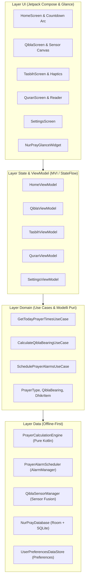

# 🕌 NurPray - Modern Islamic Companion for Android

[](https://github.com/owaismounir206-art/nurpray/actions)
[](https://kotlinlang.org)
[](https://developer.android.com/jetpack/compose)
[](https://m3.material.io)
[](https://developer.android.com/topic/architecture)
[](#privacy--ethics)
[](LICENSE)

**NurPray** è un'applicazione nativa Android all-in-one per i musulmani di tutto il mondo. Costruita da zero secondo le più moderne linee guida di Google (**Kotlin 2.x**, **Jetpack Compose**, **Material 3 / Material You**, **MVI/Clean Architecture**), offre un'esperienza utente fluida, rispettosa della privacy (**zero tracker**, **100% offline-first**) ed energeticamente efficiente.

---

## 🌟 Caratteristiche Principali

### 1. ☀️ Motore Astronomico Orari di Preghiera (100% Offline)
- **Calcolo Solare Puro:** Implementazione pura in Kotlin (senza dipendenze Android) basata su algoritmi astronomici di precisione (coordinate solari di Jean Meeus, Equazione del Tempo, declinazione e angoli zenitali).
- **Convenzioni Mondiali Supportate:**
  - Muslim World League (MWL)
  - Islamic Society of North America (ISNA)
  - Egyptian General Authority of Survey
  - Umm Al-Qura University, Makkah (90 min Maghrib-Isha)
  - University of Islamic Sciences, Karachi
  - UOIF (Francia - 12°/15°)
  - Diyanet İşleri Başkanlığı (Turchia)
  - Metodo Personalizzato (angoli configurabili)
- **Metodi Giuridici Asr:** Shafi'i/Maliki/Hanbali (rapporto ombra 1:1) e Hanafi (rapporto ombra 2:1).
- **Regole Latitudini Elevate:** Correzioni Angle-Based, Middle of the Night e One-Seventh per regioni scandinave e nordiche.

### 2. ⏰ Allarmi Esatti & Notifiche Anti-Doze
- **Evasione della modalità Doze:** Allarmi pianificati con `AlarmManager.setAlarmClock()`, che garantiscono il risveglio affidabile del dispositivo anche in sonno profondo e integrano l'orario nella lockscreen di sistema.
- **Pre-Allarme Dinamico:** Avviso discreto configurabile (es. 15, 10 o 5 minuti prima della preghiera) per dare il tempo di compiere l'abluzione (Wudu).
- **Ripristino Automatico:** `BootReceiver` che ripianifica istantaneamente gli allarmi dopo il riavvio del telefono o cambi di fuso orario (`BOOT_COMPLETED`, `TIMEZONE_CHANGED`).
- **Foreground Audio Service:** Riproduzione Adhan con gestione dell'audio focus e controlli da notifica.

### 3. 🧭 Bussola Qibla con Sensor Fusion & Canvas
- **Matematica Ortodromica:** Calcolo dell'angolo azimutale rispetto alla Kaaba ($21.422477^\circ\text{ N}, 39.826182^\circ\text{ E}$) tramite la formula Great-Circle.
- **Sensor Fusion:** Utilizzo combinato di Rotation Vector o Accelerometro + Magnetometro con filtro passa-basso per azzerare il tremolio dell'ago.
- **Correzione Declinazione Magnetica:** Allineamento al **Nord Geografico Reale** tramite `GeomagneticField`.
- **Canvas Compose & Feedback Aptico:** Ghiera animata fluida con visualizzazione distanza e bump aptico istantaneo quando il dispositivo è allineato entro $\pm 3^\circ$ con la Mecca.

### 4. 📿 Tasbih Digitale & Zikr Tracker
- **Modalità Touch-Anywhere:** Tocca in qualsiasi punto dello schermo per contare senza dover guardare il display.
- **Feedback Tattile:** Vibrazione differenziata a ogni tocco e impulso marcato al raggiungimento dell'obiettivo (33, 99 o 100).
- **Dhikr Pre-caricati:** SubhanAllah, Alhamdulillah, Allahu Akbar, Astaghfirullah, La ilaha illallah.

### 5. 📖 Corano Integrato
- **Indice delle Sure:** Con numerazione, denominazione in arabo, traslitterazione, significato e classificazione (Meccana/Medinese).
- **Lettore Ayah-by-Ayah:** Tipografia araba Uthmani leggibile affiancata da traduzione italiana.

### 6. 📱 Material You & Layout Adattivo
- **Dynamic Theming:** Adattamento automatico ai colori del wallpaper su Android 12+ (`dynamicLightColorScheme` e `dynamicDarkColorScheme`) con fallback armonizzato verde smeraldo profondo (`#0F5132`) e ambra (`#E5A93C`).
- **NavigationSuiteScaffold:** Layout che si trasforma automaticamente da Bottom Navigation (smartphone) a Navigation Rail (tablet/landscape) e Navigation Drawer (foldable/schermi ampi).
- **Card Dinamica del Momento della Giornata:** Sfumature ambientali che mutano dall'aurora (Fajr) al meriggio dorato (Dhuhr) e alla notte stellata (Isha).

### 7. 🧩 Widget Schermata Home (Jetpack Glance)
- Widget Material You con conto alla rovescia in tempo reale per la prossima preghiera e timeline orizzontale di tutte le preghiere della giornata.

---

## 🏛️ Architettura Software (Clean Architecture / MVI)



---

## 📂 Struttura del Progetto

```text
nurpray/
├── .github/
│   └── workflows/
│       └── android.yml                # CI/CD GitHub Actions (Test + Build APK)
├── app/
│   ├── src/
│   │   ├── main/
│   │   │   ├── AndroidManifest.xml   # Permessi esatti, Allarmi, Ricevitori, Servizi
│   │   │   ├── java/com/nurpray/app/
│   │   │   │   ├── MainActivity.kt   # NavigationSuiteScaffold & Edge-to-Edge
│   │   │   │   ├── NurPrayApplication.kt
│   │   │   │   ├── core/
│   │   │   │   │   ├── alarm/        # PrayerAlarmScheduler
│   │   │   │   │   ├── designsystem/ # Color, Theme (Material You), Type
│   │   │   │   │   └── notifications/# Canali e Notifiche Heads-up
│   │   │   │   ├── data/
│   │   │   │   │   ├── astronomical/ # PrayerCalculationEngine (Zero deps)
│   │   │   │   │   └── local/        # Room Database & DataStore Preferences
│   │   │   │   ├── domain/
│   │   │   │   │   ├── model/        # Modelli di dominio
│   │   │   │   │   └── usecase/      # Use Cases puri
│   │   │   │   └── feature/
│   │   │   │       ├── alarm/        # Receiver di allarme e BootReceiver
│   │   │   │       ├── home/         # HomeScreen & Countdown Arc
│   │   │   │       ├── qibla/        # QiblaSensorManager & Canvas Compass
│   │   │   │       ├── quran/        # Lettore Corano
│   │   │   │       ├── tasbih/       # Contatore Dhikr Touch-anywhere
│   │   │   │       ├── settings/     # Selezione convenzioni e regole
│   │   │   │       └── widget/       # Widget Jetpack Glance
│   │   │   └── res/                  # Icone vettoriali adaptive, stringhe, layout
│   │   └── test/
│   │       └── java/.../PrayerCalculationEngineTest.kt  # Test unitari astronomici
│   └── build.gradle.kts              # Configurazione modulo app
├── gradle/
│   └── libs.versions.toml            # Version Catalog centralizzato
├── build.gradle.kts                  # Configurazione root
├── settings.gradle.kts
└── README.md
```

---

## 🚀 Come Compilare e Avviare il Progetto

### Prerequisiti
- **JDK 17 o JDK 21**
- **Android SDK** (API 35, Build-Tools 34.0.0+)
- **Android Studio Ladybug (o successivo)** oppure terminale CLI con Gradle.

### 1. Clonare il repository
```bash
git clone https://github.com/owaismounir206-art/nurpray.git
cd nurpray
```

### 2. Eseguire i test unitari
Verifica la precisione dell'algoritmo astronomico per Makkah, Roma, Londra, Karachi e le latitudini estreme:
```bash
./gradlew testDebugUnitTest
```

### 3. Compilare l'APK Debug
```bash
./gradlew assembleDebug
```
L'APK generato sarà immediatamente disponibile in:
`app/build/outputs/apk/debug/app-debug.apk`

### 4. Installare sul dispositivo o emulatore
```bash
adb install app/build/outputs/apk/debug/app-debug.apk
```

---

## 🛡️ Privacy & Etica

- ❌ **Nessun Tracciatore:** Nessun analytics di terze parti (Firebase Analytics, Google Analytics, Facebook SDK, ecc.).
- ❌ **Nessuna Pubblicità:** Nessun banner o interstitial che distragga la concentrazione e la preghiera.
- 🔒 **100% Offline:** Tutti i calcoli di preghiera, la bussola e i testi risiedono interamente sul dispositivo locale.
- 🛰️ **GPS Rispettoso della Batteria:** La posizione viene letta solo su richiesta o tramite selezione manuale della città.

---

## 📄 Licenza

Questo progetto è rilasciato sotto licenza [Apache License 2.0](LICENSE). Libero per uso personale, modifica e redistribuzione.
